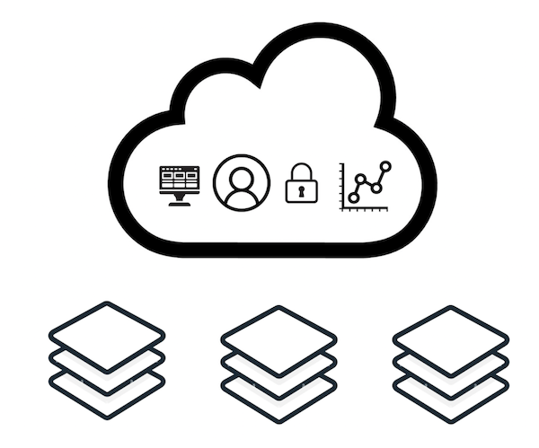
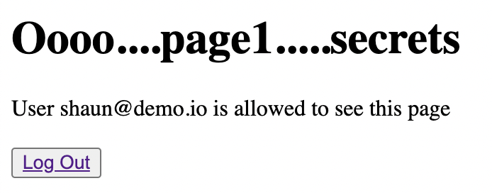
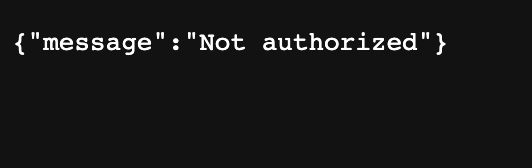

# Authorization on the Backend


## Overview

As described in the [top-level README](../README.md), the mock scenario in these examples is a company that provides SaaS.



These examples let you choose what kind of SaaS offering is provided, one of:

- [Clusters as a Service](../usecases/clusters/) (same as in the Nile Quickstart)
- [Database as a Service](../usecases/DB/)
- [SkyNet as a Service](../usecases/SkyNet/)
- [Banking as a Service](../usecases/Banking/)
- [YOLO](../usecases/README.md#yolo)

For this service, you can use Nile's built-in entities to enforce access policies.
This example demonstrates how to use your existing backend applications and add a middleware to use authorization from Nile.
It starts with an application that does just basic user authentication and then layers in [authorization](middleware/authz-nile.ts) by calling out to Nile to validate the logged in user is allowed to access the resources.

Credit: the base example of the webapp is heavily borrowed from this [authentication guide](https://github.com/LoginRadius/engineering-blog-samples/tree/master/NodeJs/NodejsAuthenticationGuide).

## Install Dependencies

1. Run the following command:

```
yarn install
```

Your output should resemble:

```bash
yarn install v1.22.19
warning package.json: No license field
warning No license field
[1/4] 🔍  Resolving packages...
[2/4] 🚚  Fetching packages...
[3/4] 🔗  Linking dependencies...
[4/4] 🔨  Building fresh packages...
✨  Done in 2.26s.
```

2. For the web application and database:

- Install and run MongoDB

  - [Install mongoDB](https://www.mongodb.com/docs/manual/tutorial/install-mongodb-on-os-x/)
  - run MongoDB in the background: `mongod --config /opt/homebrew/etc/mongod.conf &`
  - [Install mongosh](https://www.mongodb.com/docs/mongodb-shell/install/), a MongoDB CLI for logging in and cleanup

## Initialize Nile

To run these examples, you need to access to Nile. Please [reach out](https://www.thenile.dev) for more information.

1. Run through the [quickstart](../quickstart) to setup your Nile control plane. Afterwards, you will be able to use these parameters:

   - `NILE_URL`
   - `NILE_WORKSPACE`
   - `NILE_DEVELOPER_EMAIL`
   - `NILE_DEVELOPER_PASSWORD`
   - `NILE_ENTITY_NAME`: refers to one of your selected [usecases](../usecases/).

   [YOLO](../usecases/README.md#yolo): follow steps to define your own service offering (and thus a new `NILE_ENTITY_NAME`)

2. For all examples, you need a local file with your Nile configuration.
For that purpose, at the top-level of the examples, copy the `.env.defaults` file to `.env`:

   ```bash
   # From the top level of the examples folder
   $ examples> cp .env.defaults .env
   ```

   Set the values in this `.env` file to match the values you want in your control plane.

3. Run the following command to preconfigure the Nile control plane with the mock usecase so that you're not starting from scratch.

   ```bash
   yarn setup-nile
   ```

## Execute

1. First run the [application](server-without-authz.js) without Nile authorization:

```
yarn start-without-authz
```

Use any browser to go to `http://locahost:5000`. Login with any of the listed users and then click `Test authz` to the variety of pages.
Notice that all the users have access to all the pages: `page1`, `page2`, `page3`.

2. Now run the [application](server.js) with Nile authorization.

```
yarn start
```

This time, in addition to running the application, it also sets up the [Nile control plane](src/index.ts), defines entities and entity instances that correspond to the application pages, adds users to different organizations, and configures authorization policies as defined below.
These examples already provide one of the following offerings:

- [Clusters as a Service](../usecases/clusters/) (same as in the Nile Quickstart)
- [Database as a Service](../usecases/DB/)
- [SkyNet as a Service](../usecases/SkyNet/)
- [Banking as a Service](../usecases/Banking/)
- [YOLO](../usecases/README.md#yolo)

3. View the code changes required for this example application:

```
diff server.js server-without-authz.js
```

4. View the example [Nile authorization code](middleware/authz-nile.ts).


## Validate

1. Log into the [Nile Admin Dashboard](https://nad.thenile.dev/) to see the control plane and entity instances.
For the email and password, use the `NILE_DEVELOPER_EMAIL` and `NILE_DEVELOPER_PASSWORD` values you specified in the `.env` file.

2. Cross-check which users are authorized to see which pages.  For example, if you used the `Database as a Service` use case, `parker@demo.io` is in org `customer-org-1` which has entities for `myDB-products`(=page1) and `myDB-billing`(=page2).  Therefore when `parker@demo.io` tries to view either of those entities, he will be able to see those pages:



But if `shaun@demo.io` tries to view `myDB-analytics`(=page2) which belongs to a different org `customer-org-2`, he will not be able to see the page:



## MongoDB cheatsheet

Run `mongosh` to connect to your local database, here are some useful commands:

```
use role_auth;
db.users.find();
db.pages.find();
```

To cleanup and shutdown your local MongoDB collections:

```
db.users.drop();
db.pages.drop();
db.shutdownServer()
```

This script will drop those tables and drop ALL policies for those organizations:

```
yarn clean
```
