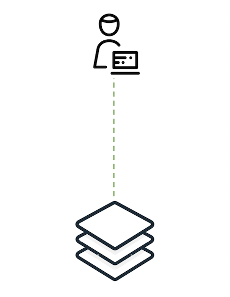
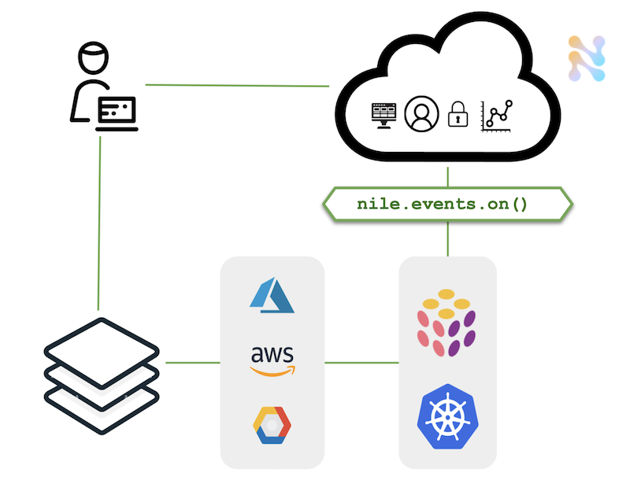
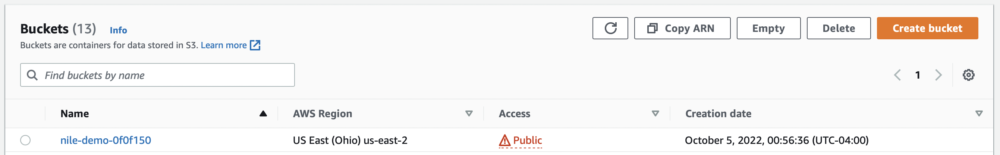
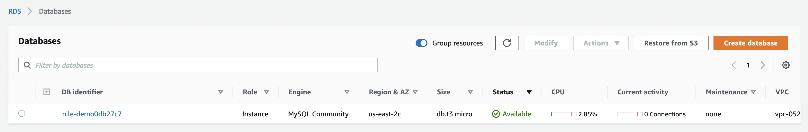

# Nile Data Plane Example #


## Overview

As described in the [top-level README](../../README.md), the mock scenario in these examples is a company that provides SaaS.

Consider an end user who logs into the SaaS and wants to provision a new instance of the service offering:



This example demonstrates how to synchronize (i.e., `reconcile`) the data
plane and control plane in real time with Nile events.
It operates on all the organizations within a Nile workspace, first synchronizing
the current state and then listening for new events.



Nile doesn't prescribe any particular data plane deployment solution, but here we'll
use [Pulumi](https://app.pulumi.com/) to deploy objects into AWS. 

If you're using another tool like Kubernetes or Terraform, replace
the [`PulumiAwsDeployment`](./src/commands/reconcile/lib/pulumi/PulumiAwsDeployment.ts) 
class in this example with your own deployment implementation.
You may also refer to the example [Data Plane with Apache Flink and Kubernetes](../k8s/).

## Contents

* [Overview](#overview)
* [Prerequisites](#prerequisites)
* [Setup](#setup)
* [Configure the Control Plane](#configure-the-control-plane)
* [Configure the Data Plane](#configure-the-data-plane)
* [Run the reconciler](#run-the-reconciler)
* [Explanation](#explanation)
* [Add or remove instances](#add-or-remove-instances)

## Prerequisites ##

This example assumes you have:

* [An AWS account](https://aws.amazon.com/free/)
* [A Pulumi account](https://app.pulumi.com/signup) that's
  [connected to your AWS account](https://www.pulumi.com/docs/get-started/aws/begin/)
* [The Pulumi CLI installed](https://www.pulumi.com/docs/reference/cli/)
* A Nile developer account
* Validate your environment has the minimum required Node version v18.0.0 or higher. If you are running earlier versions, you may encounter errors such as `ReferenceError: fetch is not defined`. (If you use `nvm`, run `nvm use`).

Note that this example creates real AWS resources so be sure to manually destroy all resources to avoid unexpected charges from AWS.

## Setup

You must do all the steps in the [Setup section](../../README.md#setup) of the top-level README.md.

:stop_sign: **STOP** :stop_sign: Do not proceed until you have done the above setup :heavy_exclamation_mark:

## Configure the Control Plane ##

There are a few ways to configure the control plane:

- [Nile Admin Dashboard](#nile-admin-dashboard): use the UI to manually configure the control plane
- [Programmatically](#programmatically): use the provided script which leverages the Nile SDK

### Nile Admin Dashboard

> If you're not familiar with the terminology used below, read the
> [Nile Quickstart](https://www.thenile.dev/docs/current/quick-start-ui).

For the values below, make sure they match what you set in the `.env` file.

1. Login to the [Nile Admin Dashboard](https://nad.thenile.dev/).
2. Create a workspace, which must be globally unique
3. Create an entity type called `DB` from [this definition](../quickstart/src/models/SaaSDB_Entity_Definition.json), which is also available as a template from the Nile Admin Dashboard.
4. Create an organization in the workspace named "Danube Tech".
5. Create an entity instance of type "DB" in the organization, with a value that matches the schema defined earlier:

```json
{
  "dbName": "myDB-products",
  "cloud": "gcp",
  "environment": "prod",
  "size": 100,
}
```

### Programmatically

1. Install and build the project

```bash
yarn install && yarn build
```

2. Configure the control plane. This command will read from the `.env` file you defined earlier. The script is idempotent and instances will be created only once.

```bash
yarn setup-nile
```

## Configure the Data Plane ##

These instructions summarize how to get started with Pulumi on AWS.
See the [Pulumi documentation](https://www.pulumi.com/docs/get-started/aws/begin/) for a more complete setup.

1. Set up a new Pulumi project called `pulumi-clustify`:

```bash
mkdir pulumi-clustify && cd pulumi-clustify
pulumi new aws-typescript
```

When prompted, accept the defaults:

```
project name: (pulumi-clustify)
project description: (A minimal AWS TypeScript Pulumi program) 
Created project 'pulumi-clustify'

Please enter your desired stack name.
To create a stack in an organization, use the format <org-name>/<stack-name> (e.g. `acmecorp/dev`).
stack name: (dev) 
Created stack 'dev'

aws:region: The AWS region to deploy into: (us-east-1)
Saved config
```

2. Run `pulumi up` to validate that Pulumi is configured correctly. This will
create a new Pulumi stack named `dev`. We won't be using this stack, but its
presence verifies that you're ready to proceed.

```bash
pulumi up
```

## Run the reconciler ##

1. Ensure that the values in your `.env` file match the values used in the setup of the control plane.

2. Decide which mode you want to run in:

   - `NILE_RECONCILER_MODE=S3`: (default) great for kicking the tires, provision a fake "database" in AWS that is actually just an S3 bucket under the hood. In contrast to above, creating an S3 bucket is very quick.

     ```bash
     export NILE_RECONCILER_MODE=S3
     ```

   - `NILE_RECONCILER_MODE=DB`: provision a MySQL database in AWS, useful for realistic demos. AWS can take a few minutes to provision these resources.

     ```bash
     export NILE_RECONCILER_MODE=DB
     ```

There are several ways to run the reconciler, each described in the following sections:

- [Using yarn](#using-yarn)
- [Executable binary](#executable-binary)
- [Docker](#docker) 

### Using `yarn`

1. Back up in the `data-plane/pulumi` directory, create the executable command binary with the following command

```bash
yarn install && yarn build
```

2. Run the reconciler. This command will read from the `.env` file you defined earlier.

```bash
yarn start
```

### Executable binary

1. Back up in the `data-plane/pulumi` directory, create the executable command binary with the following command

```bash
yarn install && yarn build
```

2. Source the `.env` parameters into your shell.  This step isn't entirely necessary since in the next step you can pass in the Nile configuration parameter values at the command line, but assuming you already went through the effort of configuring the `.env` file, may as well use it.

```bash
source .env
```

3. Run the following reconciler executable:

```bash
./bin/dev reconcile --basePath $NILE_URL \
  --workspace $NILE_WORKSPACE \
  --entity $NILE_ENTITY_NAME \
  --email $NILE_DEVELOPER_EMAIL \
  --password $NILE_DEVELOPER_PASSWORD
```

### Docker

1. Back up in the `data-plane/pulumi` directory, if you haven't setup your control plane yet, set it up now:

```bash
yarn setup-nile
```

2. Run the reconciler Docker image. Ensure that you have valid values for the three input parameters required to connect to AWS (`AWS_ACCESS_KEY_ID` and `AWS_SECRET_ACCESS_KEY`) and Pulumi (`PULUMI_ACCESS_TOKEN`):

```bash
docker run --init --rm \
  --env-file .env \
  -e NILE_RECONCILER_MODE=S3 \
  -e AWS_ACCESS_KEY_ID=$(aws configure get aws_access_key_id) \
  -e AWS_SECRET_ACCESS_KEY=$(aws configure get aws_secret_access_key) \
  -e PULUMI_ACCESS_TOKEN=$PULUMI_ACCESS_TOKEN \
  theniledev/reconciler:v0.5
```

## Explanation

The reconciler will immediately find the newly instantiated DB instance in the Nile
control plane and create a Pulumi stack that represents it.
The Pulumi API creates these resources in AWS with public access.
The reconciler will also log the instance properties and update the instance in the Nile control plane with its status and connection information.

### Modes

As mentioned earlier, there are two modes:

1. `NILE_RECONCILER_MODE=S3`: (default) fake "database" in AWS S3 bucket created by [`pulumiS3.ts`](./src/commands/reconcile/lib/pulumi/pulumiS3.ts). Runs faster.


```bash
 +  aws:s3:BucketObject index created 

 +  pulumi:pulumi:Stack pulumi-clustify-inst_02r9hCo4dxhwqkHHDwfRGg created 

Outputs:

    ....
    websiteUrl  : "https://nile-demo-0f0f150.s3.us-east-2.amazonaws.com/index.html"

Resources:
    + 4 created

Duration: 5s
```



Coolness! You can now view this page by navigating to `websiteUrl` from your browser.

2. `NILE_RECONCILER_MODE=DB`: MySQL database in AWS created by [`pulumiDB.ts`](./src/commands/reconcile/lib/pulumi/pulumiDB.ts). Runs slower.

```bash
 +  aws:rds:Instance nile-demo created 

 +  pulumi:pulumi:Stack pulumi-clustify-inst_02r9iq53n2fvsNjJQBr91m created 
 

Outputs:
    address : "nile-demoa9f81e9.clrb45fomzui.us-east-2.rds.amazonaws.com"
    endpoint: "nile-demoa9f81e9.clrb45fomzui.us-east-2.rds.amazonaws.com:3306"

Resources:
    + 2 created

Duration: 4m8s
```



Coolness! You can now connect to this database (e.g. with a local MySQL client or Docker `docker run -it --rm mysql mysql -h${address} -ufoo -ppassword` or your preferred means) and then run `show databases;` to see your newly created database. If you have problems connecting, doublecheck that the AWS security group is properly configured.

## Add or Remove Instances ##

While the reconciler is running, in the [Nile Admin Dashboard](https://nad.thenile.dev/), add one or
more new DB instances. This will trigger events that the
reconciler receives and the data plane will synchronize accordingly. Deleting an instance in the
control plane will result in destruction of the corresponding Pulumi stack.

With the current implementation of the [reconciler example](src/commands/reconcile/index.ts), if the reconciler stops running for a period of time and then restarts, the events that occurred during the down time are handled as follows:

- _New_ entity instances that were created will be reconciled in the data plane
- _Old_ entity instances that were deleted will be reconciled in the data plane
- _Existing_ entity instances that were updated will not be automatically reconciled in the data plane because the current example just compares instance IDs. It is left to the developer to apply their own logic to detect the change and to determine what action to take to update the data plane, if any.
