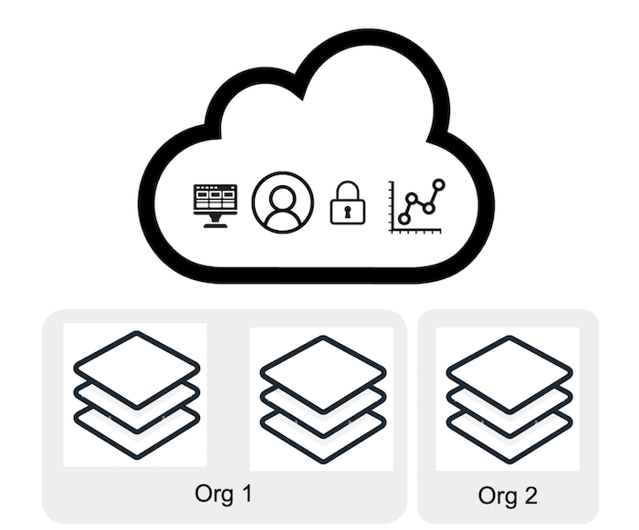
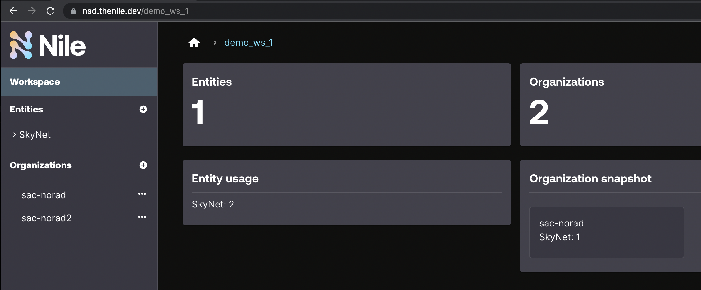

# Multi-tenancy


## Overview

As described in the [top-level README](../README.md), the mock scenario in these examples is a company that provides SaaS.



This example demonstrates multi-tenancy with multiple organizations and isolated users within each organization.
It sets up the following control plane in Nile:

- Sign up a new developer
- Create a workspace, which must be globally unique
- Create an entity type called that corresponds to whatever `NILE_ENTITY_NAME` is defined in your `.env` file (many are also available as a template from the Nile Admin Dashboard).  The available entity types are [here](../usecases/).
- Create two organizations with users
- Create 2 entity instance in one organization and 1 entity instance in other organization, with a value that matches the schema defined earlier

## Install Dependencies

Run the following command:

```
yarn install
```

Your output should resemble:

```bash
yarn install v1.22.19
warning package.json: No license field
warning No license field
[1/4] 🔍  Resolving packages...
[2/4] 🚚  Fetching packages...
[3/4] 🔗  Linking dependencies...
[4/4] 🔨  Building fresh packages...
✨  Done in 2.26s.
```

## Setup

For all examples, you need a local file with your Nile configuration.
For that purpose, at the top-level of the examples, copy the `.env.defaults` file to `.env`:

```bash
# From the top level of the examples folder
$ examples> cp .env.defaults .env
```

Set the values in this `.env` file to match the values you want in your control plane.


## Execute

To execute the workflow, run the following command:

```
yarn start
```

## Validate

1. Log into the [Nile Admin Dashboard](https://nad.thenile.dev/) to see the control plane and entity instances.  For the email and password, use the `NILE_DEVELOPER_EMAIL` and `NILE_DEVELOPER_PASSWORD` values you specified in the `.env` file.  Your dashboard should resemble below:



2. Validate tenant isolation by running the command below. For example, if you used the `Database as a Service` use case, at first user polina@demo.io cannot see the organization `customer-org-2` nor any instances in it, but after adding polina@demo.io to `customer-org-2`, polina@demo.io can see all the instances in `customer-org-2` that frank@demo.io can see.

```
yarn test
```


