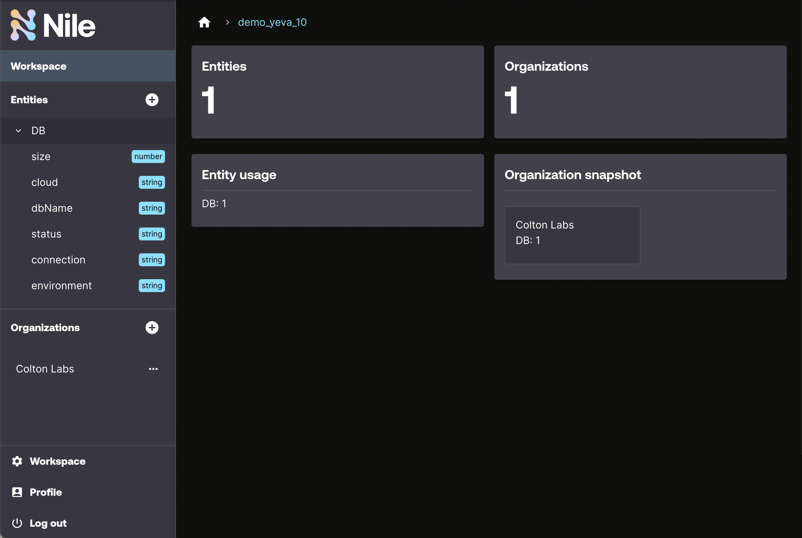

# Quickstart


## Overview

This quickstart creates (or validates the existence of) the following control plane in Nile:

- Sign up a new developer
- Create a workspace, which must be globally unique
- Create an entity called `SkyNet`
- Create an organization with a user:
  - `sac-norad` with user nora1@demo.io
- Create a `SkyNet` entity instance in the organization

## Install Dependencies

Run the following command:

```
yarn install
```

Your output should resemble:

```bash
yarn install v1.22.19
warning package.json: No license field
warning No license field
[1/4] 🔍  Resolving packages...
[2/4] 🚚  Fetching packages...
[3/4] 🔗  Linking dependencies...
[4/4] 🔨  Building fresh packages...
✨  Done in 2.26s.
```

## Setup

For all examples, you need a local file with your Nile configuration.
For that purpose, at the top-level of the examples, copy the `.env.defaults` file to `.env`:

```bash
# From the top level of the examples folder
$ examples> cp .env.defaults .env
```

Set the values in this `.env` file to match the values you want in your control plane.


## Execute

To execute the workflow, run the following command:

```
yarn start
```

## Validate

Log into the [Nile Admin Dashboard](https://nad.thenile.dev/) to see the control plane and entity instances.
For the email and password, use the `NILE_DEVELOPER_EMAIL` and `NILE_DEVELOPER_PASSWORD` values you specified in the `.env` file.

Your dashboard should resemble below:


