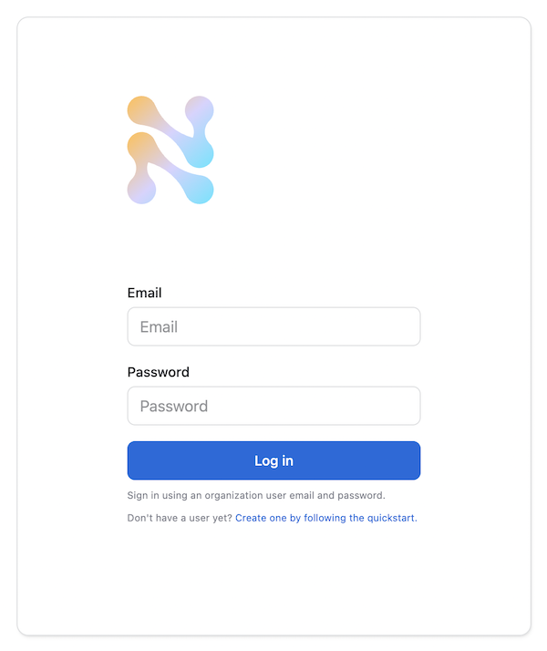
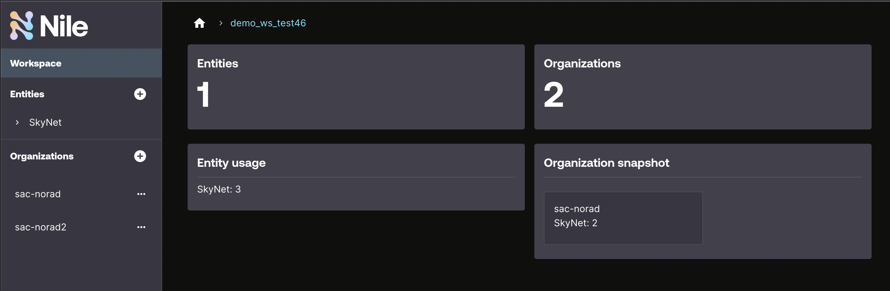

# Webapp Frontend


## Overview

This examples uses [Next.js](https://nextjs.org/) to create a frontend for a SaaS application integrated with [Nile](https://thenile.dev/).
The app is completely self-serve, allowing end users to sign up on their own, create their own organization, and manage their own instances.

## Setup

To run these examples, you need to access to Nile. Please [reach out](https://www.thenile.dev) for more information.

1. Create certificates for your local machine and accept them. The Nile backend will only serve cookies to `\*.thenile.dev` domains, which is required for login

- edit `/etc/hosts` and add `127.0.0.1 local.thenile.dev`.
- `mkdir .certificates && cd .certificates`
- add an ssl key (this one lasts 1 year)

   ```bash
   openssl req -x509 -out localhost.crt -keyout localhost.key \
     -days 365 \
     -newkey rsa:2048 -nodes -sha256 \
     -subj '/CN=*.thenile.dev' -extensions EXT -config <( \
     printf "[dn]\nCN=*.thenile.dev\n[req]\ndistinguished_name = dn\n[EXT]\nsubjectAltName=DNS:*.thenile.dev\nkeyUsage=digitalSignature\nextendedKeyUsage=serverAuth")
   ```

2. Open the certificate just created (`open localhost.crt`), and double click on the certificate in your keychain.

3. From the pop up window, open the dropdown for `Trust` and select `Always Trust`.

4. For all examples, you need a local file with your Nile configuration.
For that purpose, at the top-level of the examples, copy the `.env.defaults` file to `.env`:

```bash
# From the top level of the examples folder
$ examples> cp .env.defaults .env
```

Set the values in this `.env` file to match the values you want in your control plane.

## Install Dependencies

```bash
yarn install
```

## Setup

Run the following command to preconfigure the Nile control plane just so you're not starting from scratch: entity definition called [SaaSDB](../quickstart/src/models/SaaSDB_Entity_Definition.json), two organizations with users from [userList.json](../quickstart/src/datasets/userList.json), and entity instances from [dbList.json](../quickstart/src/datasets/dbList.json).

```bash
yarn setup-nile
```

## Run the web server locally

```bash
yarn dev
```

## Validate

1. As an end user: open [https://local.thenile.dev](http://local.thenile.dev) with your browser and log in as one of the predefine users from [userList.json](../quickstart/src/datasets/userList.json).

   The user login screen should resemble below:

   

2. Once logged in (e.g. as `nora@demo.io`), the user sees the entity instances (e.g. databases in this mock scenario) that she has access to.

   

3. Logout. Then instead of logging in as an existing user, sign up as a new user.  Enter any email/password, then create an organization name.

4. Create a new SaaSDB instance.

5. As a Nile developer: log into the [Nile Admin Dashboard](https://nad.thenile.dev/) to see the control plane and entity instances.
For the email and password, use the `NILE_DEVELOPER_EMAIL` and `NILE_DEVELOPER_PASSWORD` values you specified in the `.env` file.

   Your dashboard should resemble below:

   
