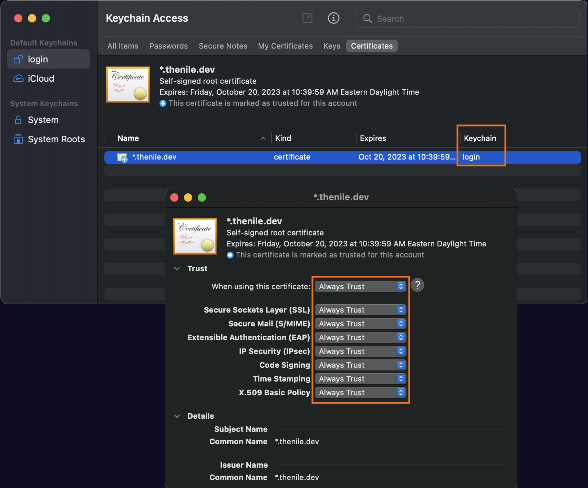

# Self-serve Webapp


## Overview

This example shows a SaaS service integrated with [Nile](https://thenile.dev/). 
Nile provides an entity system, event system, and tenant-aware metrics.

The mock scenario in these examples is a company that provides SaaS.


These examples let you choose what kind of SaaS offering is provided, one of:

- [Database as a Service](../usecases/DB/) (same as in the Nile Quickstart)
- [SkyNet as a Service](../usecases/SkyNet/)
- [Banking as a Service](../usecases/Banking/)
- [Workload as a Service](../usecases/Workload/)
- [YOLO](../usecases/README.md#yolo)

Everything you need to run this example is in one of the folders above.
Once a developer initializes their control plane in Nile with their service's entity schema, they can capture events as end users create new instances to reconcile Nile with their data plane, get built-in multi-tenancy and authorization policies, and show metrics to users for consumption and billing.
This webapp demonstrates a sample frontend for their SaaS application that integrates with the control plane using Nile React components for [Next.js](https://nextjs.org/).
It provides self-service workflows for user signup/login, org creation, and instance management.


## Contents

* [Overview](#overview)
* [Prerequisites](#prerequisites)
* [Initialize Nile](#initialize-nile)
* [Run the web server locally](#run-the-web-server-locally)
* [Playbook](#playbook)

## Prerequisites

1. Your environment should have the following installed:

   - `node`
   - `ts-node`
   - `yarn` (or `npm`)

2. Run the following command from the `webapp` directory:

   ```
   yarn install
   ```

### Setup certificates

Currently, Nile will only serve cookies to `\*.thenile.dev` domains, which is required for login, so you must put this webapp in that domain. Create certificates for your local machine and add them to your keychain.

1. Edit the file `/etc/hosts` and at the bottom, add the line `127.0.0.1 local.thenile.dev`

2. From the `webapp` directory, create a new directory for certificates.

   ```bash
   mkdir .certificates
   ```

3. Run the following command to add an SSL key that lasts 1 year

   ```bash
   (cd .certificates && \
      openssl req -x509 -out localhost.crt -keyout localhost.key \
        -days 365 \
        -newkey rsa:2048 -nodes -sha256 \
        -subj '/CN=*.thenile.dev' -extensions EXT -config <( \
        printf "[dn]\nCN=*.thenile.dev\n[req]\ndistinguished_name = dn\n[EXT]\nsubjectAltName=DNS:*.thenile.dev\nkeyUsage=digitalSignature\nextendedKeyUsage=serverAuth"))
   ```

3. Trust the new certificate you just created

   - Run `open .certificates/localhost.crt` to open it in Keychain.
   - Make sure the certificate is under `Login` (not `System`), moving it there if necessary.
   - Double click on the certificate, and from the popup window, expand the `Trust` dropdown and select `Always Trust`.

   

## Initialize Nile

To run these examples, you need to access to Nile. Please [reach out](https://www.thenile.dev) for more information.

1. For all examples, you need a local `.env` file configured for your Nile control plane.
For that purpose, at the top-level of the examples, copy the `.env.defaults` file to `.env` and then edit the new `.env` file to match your existing workspace.

   ```bash
   # From the top level of the examples folder
   $ cp .env.defaults .env
   ```

3. Run the following command from the `webapp` directory to preconfigure the Nile control plane with the mock usecase so that you're not starting from scratch.

   ```bash
   yarn setup-nile
   ```

4. (Optional) If you want to hook up your Nile control plane to a data plane and provision real resources, run the reconciler to synchronize events between the control plane and data plane (e.g. if you use the webapp to create new entity instances). Follow the instructions in the [Pulumi example](../data-plane/pulumi/) and start the reconciler in a separate terminal window.  If you skip this step, the instances in your webapp will not go to `status=Up`.

## Run the web server locally

Run the following command from the `webapp` directory to run the web server locally:

```bash
yarn dev
```

## Playbook

1. As an end user: open [https://local.thenile.dev](http://local.thenile.dev) with your browser and log in as one of the predefined users for the entity type from the [usecases](../usecases/). For example, for entity type `DB`, you can log in as `polina@demo.io` (password is `password`).

   The user login screen should resemble below:

   

2. Once logged in, the user sees the entity instances (e.g. databases in this mock scenario) that she has access to.

   

3. Click on one of the instances to see metrics. These metrics are currently mock generated from the webapp itself, so it will take some time for them to initialize and start to render.

   

4. Logout. Then instead of logging in as an existing user, sign up as a new user.  Enter any email/password, then create an organization name.

5. Create a new instance.  If you are running the reconciler in a separate terminal window (see [initialize Nile](#initialize-nile)), then observe the resources being provisioned and updating Nile with its status.

6. As a Nile developer: log into the [Nile Admin Dashboard](https://nad.thenile.dev/) to see the control plane and entity instances.
Notice the multi-tenancy features, with tenants belonging to different organizations.
For the email and password, use the `NILE_DEVELOPER_EMAIL` and `NILE_DEVELOPER_PASSWORD` values you specified in the `.env` file.

   Your dashboard should resemble below:

   
